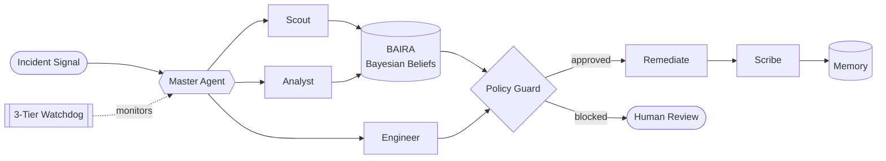

<div align="center">


[](https://git.io/typing-svg)

<br/>

[](https://linkedin.com/in/shreya-767b88328)
[](mailto:shreyaforb@gmail.com)
[](https://github.com/Busy-pond)
[](https://devpost.com/23051382)


</div>

<br/>


## `> UNIT_PROFILE.sys`

```yaml
designation : Shreya
node        : KIIT University · B.Tech CSE · Class of 2027
gpa         : ~9.09 / 10
roles       : [AI/ML Engineer, Full-Stack Developer, Robotics Lead]
rank        : VP @ KIIT Robotics Society (100+ members)
base        : Bhubaneswar, Odisha, IN
certs       : [Cisco CCNA, Google Cloud Arcade]
objective   : Build systems that think, move & act
status      : OPEN_TO -> AI/ML & Full-Stack internships
```

<br clear="right"/>


## `> ACTIVE_PROCESSES`


```diff
+ [RUNNING]  Multi-agent LLM systems, idea -> deploy
+ [RUNNING]  PostgreSQL · Next.js · TypeScript · AWS
+ [RUNNING]  Core CS: OS · DBMS · CN · COA · TOC · Compilers
+ [RUNNING]  Amazon ML Challenge: entity resolution, CPU-only
+ [RUNNING]  GATE 2027 + campus placement prep
+ [RUNNING]  Leading KIIT Robotics Society
```

<br clear="right"/>


## `> TECH_ARSENAL`

<div align="center">


**INTELLIGENCE CORE**
[](https://skillicons.dev)

**NEURAL SUBSYSTEMS**
[](https://skillicons.dev)

**FULL-STACK GRID**
[](https://skillicons.dev)

**CLOUD & DEVOPS**
[](https://skillicons.dev)

**HARDWARE INTERFACE**
[](https://skillicons.dev)

</div>

> **Specialist modules:** `LangGraph` `LangChain` `RAG` `ChromaDB` `XGBoost` `YOLOv8` `DistilBERT` `all-MiniLM-L6-v2` `Gemini` `Vertex AI` `Scikit-Learn` `Drizzle ORM` `Supabase` `SSE` `MCP` `CCNA / OSI troubleshooting`


## `> MISSION_LOGS`

<table>
<tr>
<td width="50%" valign="top">

### 🛰️ Genesis / Sentinel
**`AUTONOMOUS SRE INCIDENT RESPONSE`**

`LangGraph` `FastAPI · SSE` `Next.js` `GitHub MCP`

Cooperating agents triage and resolve incidents. Bayesian belief updating (BAIRA), a three-tier watchdog, and a GitHub MCP security-audit worker.

</td>
<td width="50%" valign="top">

### 🛡️ FraudGuard
**`REAL-TIME FRAUD DETECTION`**

`XGBoost` `FastAPI` `React` `LangGraph`

ML scoring plus a multi-agent LLM layer (Claude + Kimi) that explains and escalates suspicious transactions.

</td>
</tr>
<tr>
<td width="50%" valign="top">

### 🌐 NetSage AI
**`HUMAN-IN-THE-LOOP NETWORK DIAGNOSTICS`**

`Python` `LLM` `Rule Engine` `CCNA`

Diagnoses Cisco-style faults across OSI layers: rule checker, AI diagnosis, 32-case ground-truth dataset, human review.

</td>
<td width="50%" valign="top">

### 🔐 Cyttack
**`CYBERSECURITY DASHBOARD`**

`React + Vite` `Express` `PostgreSQL` `Drizzle` `pnpm`

Full-stack security dashboard shipped on Vercel + Railway with Supabase and a dark cyber UI.

</td>
</tr>
<tr>
<td width="50%" valign="top">

### 📚 [Study Buddy](https://devpost.com/software/study-buddy-kf1rus)
**`AI THAT ARGUES BACK · PIXEL.GEMINI`**

`LangGraph` `Gemini 2.5 Flash Lite` `ChromaDB` `Tailwind`

**RAG Q&A · Auto Quiz · Devil's Advocate.** It challenges your notes instead of agreeing. Built full stack, solo.

</td>
<td width="50%" valign="top">

### 🚨 Scam Shield
**`NLP FRAUD INTENT ENGINE`**

`DistilBERT` `PyTorch` `CUDA` `FastAPI`

Multi-head classifier detecting fraud intent in real time, GPU-accelerated with Softmax confidence calibration.

</td>
</tr>
<tr>
<td width="50%" valign="top">

### 🧮 Amazon ML Challenge
**`BUSINESS ENTITY RESOLUTION · IN PROGRESS`**

`Python` `Scikit-Learn` `Blocking + Matching`

Match records across three sources to canonical entities (F₀.₅), engineered for CPU and limited resources.

</td>
<td width="50%" valign="top">

### 🌍 Portfolio
**`PERSONAL DEV PORTFOLIO`**

`HTML` `CSS`

Responsive, clean, honest navigation. Good design is good engineering.

</td>
</tr>
</table>

### 🧠 Architecture Spotlight: Sentinel agent mesh




## `> COMBAT_RECORD`

```
[🥈] 2ND PLACE  ·  IIT Kharagpur, Kshitij 2026
[🏅] TOP 24     ·  ML Hackathon "Brain Dead", IIEST Shibpur, 2024
[🏁] ENTERED    ·  PIXEL.GEMINI Hackathon (Study Buddy)
[🛡️] CERTIFIED  ·  Cisco CCNA
[☁️] COMPLETED  ·  Google Cloud Arcade
[⚙️] ACTIVE     ·  VP, KIIT Robotics Society · 100+ members · 2025 -> ∞
```

<details>
<summary><b>▶ EXPAND: SYSTEM LOADOUT</b></summary>

```
LANGUAGES   :  Python · Java · C++ · C · JavaScript · TypeScript
AI / ML     :  LangGraph · LangChain · RAG · ChromaDB · PyTorch · XGBoost · DistilBERT
BACKEND     :  FastAPI · Node.js · Express · REST · SSE · PostgreSQL
FRONTEND    :  React · Next.js · Tailwind · Vite
DEVOPS      :  Docker · Kubernetes · GCP · AWS · Vercel · Railway
NETWORKING  :  CCNA · OSI-layer troubleshooting
HARDWARE    :  Raspberry Pi · Arduino
WORKFLOW    :  Iterative, artifact-driven builds with a working deliverable at every phase
```

</details>


## `> SIGNAL_STRENGTH`

<div align="center">

[](https://github.com/Busy-pond)

</div>

## `> ARCADE_MODE`

<div align="center">

<picture>
  <source media="(prefers-color-scheme: dark)" srcset="https://raw.githubusercontent.com/Busy-pond/Busy-pond/output/pacman-contribution-graph-dark.svg" />
  <source media="(prefers-color-scheme: light)" srcset="https://raw.githubusercontent.com/Busy-pond/Busy-pond/output/pacman-contribution-graph.svg" />
  
</picture>

<br/><br/>

[](mailto:shreyaforb@gmail.com)


</div>
